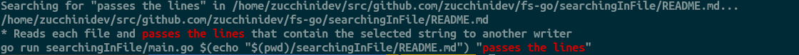

#Objectives

* Reads a directory path and a string to search from the arguments
* Gets a list of files in the selected path
* Reads each file and passes the lines that contain the selected string to another writer
* This other writer will inject color characters to highlight the string and copy its content to the standard output


We are going to create a writer that will print the rows with a match and highlight the text.

Color injection in a Unix shell:

* \x1b: An escape character
* [: An opening bracket
* 39: A number
* m: The letter m

The number determines both the background and foreground color. For this example, we'll use 31 (red) and 39 (default).

```bash

go run searchingInFile/main.go $(echo "$(pwd)/searchingInFile/README.md") "passes the lines"

```

## Output

